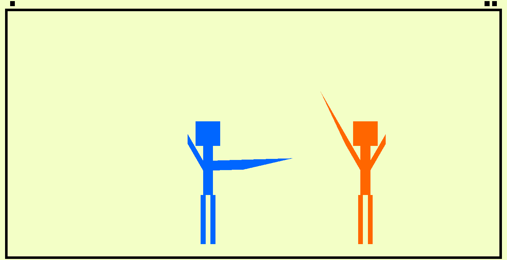

# Rewind Time (everybody)

Author: Malek Anabtawi

Design: A simple two-player stickman sword fighter with a time-rewinding mechanic.

Screen Shot:

How To Play:

Controls:

Player 1 (blue):
	
	- D: Slide right.
	- A: Slide left.
	- W: Attack.
	- S: Rewind time.

Player 2 (red/orange/??):

	- LEFT: Slide left.
	- RIGHT: Slide right.
	- UP: Attack.
	- DOWN: Rewind time.

Notes of interest:

	- The cooldown on attacks is intentionally long, due to the lack of a guard mechanic.
	- Each plaayer gets three different colors - a "normal state" color, a "rewinding state" color, and a "cooldown state" color. 
	- When you rewind time, your past actions are performed three times as quickly. You can use this to "dash" towards your opponent, to reset the cooldown animation on your attack, or to quickly retreat.
	- You can rewind time for as long as you are holding down the rewind button.
	- You can rewind for up to 1.5 seconds; releasing lets you stop early.
	- There is a cooldown of six seconds during which you cannot rewind (after you rewind). 
	- Only one player can be in a state of rewinding at any given time. 
	- It is possible for the two players to "overlap" when one of them is going back in time. This is not normally possible. If this happens, the rewinding player is found guilty of causing a rift in the space/time continuum and promptly loses the round. This adds some risk when rewinding (besides the opponent knowing your path).
	

This game was built with [NEST](NEST.md).
